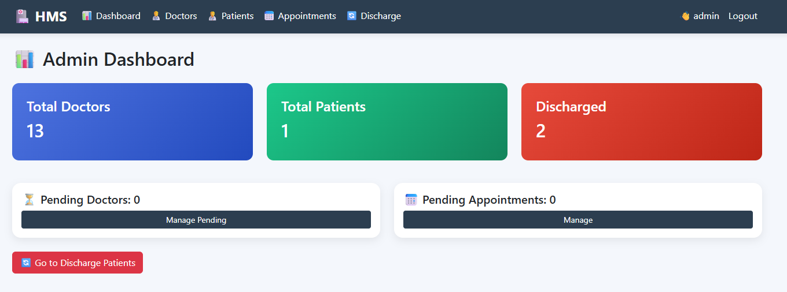
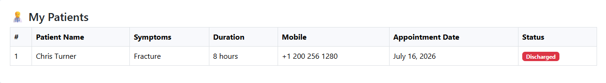
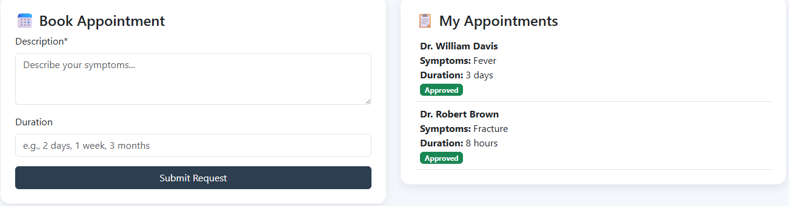
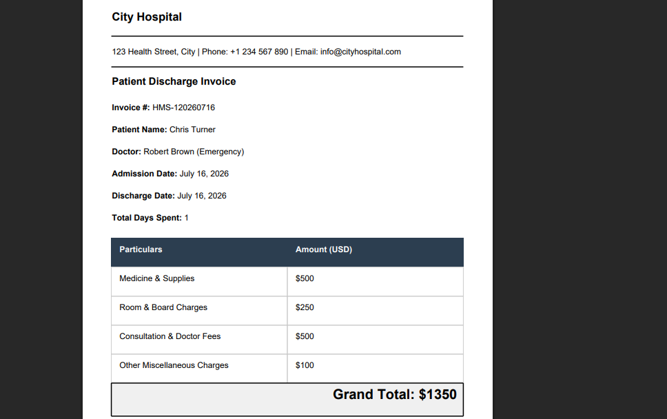

# 🏥 Hospital Management System – Role-Based Healthcare Platform

[](https://www.python.org/)
[](https://www.djangoproject.com/)
[](https://www.sqlite.org/)
[](https://getbootstrap.com/)
[](https://developer.mozilla.org/)
[](https://opensource.org/licenses/MIT)

> A full-featured Hospital Management System built with Django, featuring a multi-model schema, Role-Based Access Control, appointment workflows, and automated PDF invoice generation.

---

## 📌 Table of Contents

- [Overview](#-overview)
- [Features](#-features)
- [Tech Stack](#-tech-stack)
- [Architecture](#-architecture)
- [Installation & Setup](#-installation--setup)
- [Running the Application](#-running-the-application)
- [Core Workflows](#-core-workflows)
- [Screenshots](#-screenshots)
- [Cleanup & Publishing](#-cleanup--publishing)
- [Roadmap](#-roadmap)
- [Contributing](#-contributing)
- [License](#-license)

---

## 🧾 Overview

The **Hospital Management System** is a secure and organized platform designed to streamline healthcare facility operations. It empowers hospital administrators to handle doctor onboarding, patient records, and billing, all within an authenticated, role-specific web application.

Patients can easily register and book appointments, doctors can track their assigned patients, and administrators have full control over approvals, doctor-patient assignments, and discharging with automated PDF billing.

---

## ✨ Features

### 👑 Admin
- **Dashboard** – Overview of hospital operations and user statistics.
- **Doctor Management** – Add, approve, edit, and delete doctor profiles.
- **Appointment Control** – Approve pending appointments and assign them to specific doctors.
- **Discharge & Billing** – Discharge patients, calculate bills, and instantly generate PDF invoices.

### 👨‍⚕️ Doctor
- **Patient Tracking** – View all assigned patients in the "My Patients" dashboard.
- **Profile Management** – Manage personal details and availability.

### 🤒 Patient
- **Registration** – Seamless self-registration (auto-approved).
- **Appointments** – Book appointments by providing symptoms and expected duration.
- **Records & Invoices** – Access treatment history and download PDF discharge invoices.

---

## 🛠️ Tech Stack

| Category       | Technology                        |
|----------------|------------------------------------|
| Backend        | Python, Django 4.2.7               |
| Database       | SQLite (default multi-model schema)|
| Frontend       | HTML, CSS, Bootstrap 5             |
| PDF Generation | xhtml2pdf                          |
| Architecture   | Django MVT (Model-View-Template)   |

---

## 🧱 Architecture

- **Backend** – Django MVT architecture securely handling authenticated user workflows.
- **Frontend** – Responsive templates styled with Bootstrap 5.
- **Security** – Django's built-in authentication for secure session management and role-based access restrictions.
- **PDF Generation** – Server-side rendering using `xhtml2pdf` to convert HTML billing templates directly into downloadable PDFs.

---

## 📦 Installation & Setup

### Prerequisites
- Python 3.x
- pip (Python package manager)

### 1. Clone the repository
```bash
git clone https://github.com/prathmesh/hospital-management-system.git
cd hospital-management-system
```

### 2. Virtual environment setup
```bash
# Windows
python -m venv venv
venv\Scripts\activate

# Mac/Linux
python3 -m venv venv
source venv/bin/activate
```

### 3. Install dependencies
```bash
pip install -r requirements.txt
```

### 4. Database setup
```bash
python manage.py makemigrations
python manage.py migrate
```

---

## 🚀 Running the Application

### 1. Create admin account
```bash
python manage.py createsuperuser
```

### 2. Seed doctors (optional)
Populate the database with sample doctor profiles.
```bash
python seed_doctors.py
```
*(Seeded doctor credentials — Username: `firstname.lastname`, Password: `password123`)*

### 3. Start the server
```bash
python manage.py runserver
```

The application will be available at `http://localhost:8000`.

---

## 🔄 Core Workflows

| Actor   | Action           | Description                                             |
|---------|-------------------|-----------------------------------------------------------|
| Admin   | Initialize        | Creates or seeds initial doctor accounts.                 |
| Patient | Register & Book   | Registers (auto-approved) and books an appointment (symptoms + duration). |
| Admin   | Approve & Assign  | Reviews appointment, approves it, and assigns it to a doctor. |
| Doctor  | Treat             | Views assigned patients in the "My Patients" panel.        |
| Admin   | Discharge         | Processes billing details and discharges the patient.      |
| Patient | Download          | Logs in to download the final PDF invoice.                 |

---

## 📸 Screenshots

*(Add actual screenshots of your application here)*

- **Admin Dashboard**
  

- **Doctor's Patient View**
  

- **Appointment Booking**
  

- **PDF Invoice Generation**
  

---

## 🧹 Cleanup & Publishing

If you are preparing this repository for a fresh GitHub push, use this checklist to ensure no local data is committed:

| Item                     | Action                          | Status |
|---------------------------|----------------------------------|--------|
| `db.sqlite3`              | Delete                          | ✅ |
| `main/migrations/0*.py`   | Delete (keep `__init__.py`)     | ✅ |
| `venv/` folder            | Delete                          | ✅ |
| `media/` folder           | Delete                          | ✅ |
| `__pycache__/` folders    | Delete                          | ✅ |
| `*.pyc` files              | Delete                          | ✅ |
| `.gitignore`               | Create                          | ✅ |
| `requirements.txt`         | Keep                             | ✅ |
| `seed_doctors.py`          | Keep                             | ✅ |

**Summary of clean state:**
- Database is completely empty (no patient/doctor records).
- No dependencies or virtual environments included.
- Media folder is wiped (no sample profile pictures).
- All source code is preserved and ready for a fresh install.

---

## 🗺️ Roadmap

- [x] Role-based access for Admin, Doctor, and Patient
- [x] Appointment booking and approval workflow
- [x] Doctor-patient assignment
- [x] Automated PDF invoice generation on discharge
- [ ] Email/SMS notifications for appointment status
- [ ] Doctor availability calendar
- [ ] Advanced billing reports (CSV/Excel export)
- [ ] Multi-branch / multi-hospital support

---

## 🤝 Contributing

Contributions are welcome! Please follow these steps:

1. Fork the repository.
2. Create a new branch: `git checkout -b feature/your-feature`.
3. Commit your changes: `git commit -m 'Add some feature'`.
4. Push to the branch: `git push origin feature/your-feature`.
5. Open a Pull Request.

Please ensure your code adheres to the existing style and includes appropriate tests.

---

## 📄 License

This project is licensed under the MIT License – see the [LICENSE](LICENSE) file for details.

---

**Built with ❤️ by Prathmesh M**
